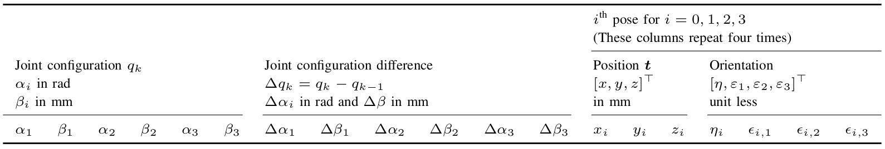

## Joint Space and Task Space Representations for Concentric Tube Continuum Robots 

In this repository, different representations are used to generate new smaller datasets based on the CRL-Dataset-CTCR-Pose.
Code and derived datasets will be provided.


### A Dataset and Benchmark for Learning the Kinematics of Concentric Tube Continuum Robots

We use a dataset captured from a three-tube concentric tube continuum robot for use in learning-based kinematics research.
The dataset consists of 100 000 joint configurations and the corresponding four 6 dof sensors in SE(3) measured with an electromagnetic tracking system.
The dataset has been collected in eight sequences. 
Each sequence encompasses 12 500 dataset points. 
A dataset point consists all 6 dof of Cartesian space SE(3) described by the singularity free quaternion/vector-pairs for each sensor pose, all 6 dof of joints space Q, and the difference in joint space configuration to the previous configuration.

CRL-Dataset-CTCR-Pose is a lightweight dataset and has a size of 56.5 MB.
It is provided as a CVS file.
A dataset point consists:

- six absolute joint values
- six relative joint values
- pose of the base
- pose of the proximal sensor attached to the outermost tube
- pose of the sensor attached to the middle tube
- pose of the distal sensor attached to the most inner tube

The annotation of the dataset is provided in table below.



For more details on the dataset, our [paper](https://openreview.net/pdf?id=DW9uz_GZ0og) provide implementation details on the data acquisition and a brief overview of the used testbed including the robotic prototype.
Furthermore, insights on learning the kinematics of this type of robot and a discussion on open challenges are provided.

### BibTex

If you want to cite our CRL-Dataset-CTCR-Pose, you can use our paper [(Preprint)](https://openreview.net/pdf?id=DW9uz_GZ0og):

```bibtex
    @inproceedings{GrassmannBurgner-Kahrs_et_al_IROS_2022,
        title       =   {A Dataset and Benchmark for Learning the Kinematics of Concentric Tube Continuum Robots},
        author      =   {Grassmann, Reinhard M. and Chen, Ryan Zeyuan and Liang, Nan and Burgner-Kahrs, Jessica},
        booktitle   =   {IEEE/RSJ International Conference on Intelligent Robots and Systems},
        year        =   {2022},
        pages       =   {}
    }
```
